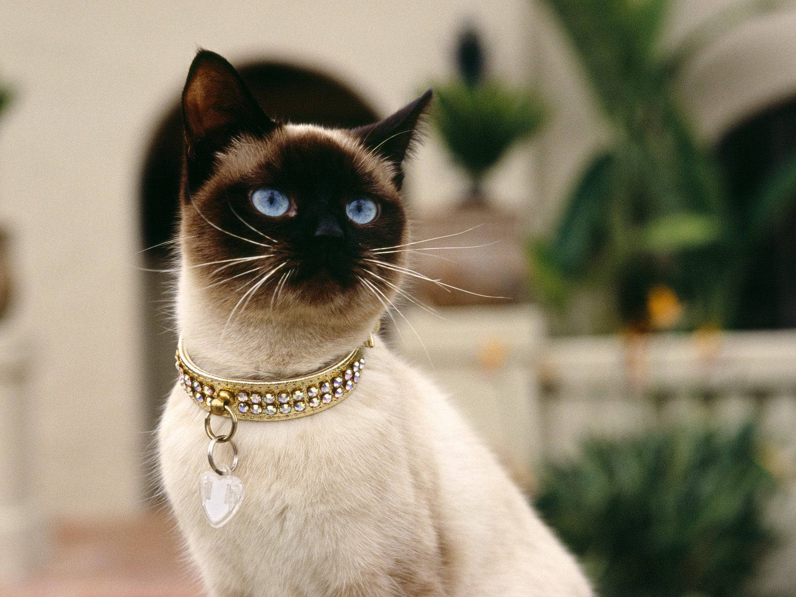

# **_Siamese Cat_**

>They are one of several varieties of cats that originated from Thailand (known as Siam prior to 1939)

## History ##

Siamese cats have a long history, originating in Siam (now Thailand) where they were considered sacred and used to guard Buddhist temples. In 1880, the king of Siam gifted two pairs of Siamese cats to the English consul-general in Bangkok, which led to their popularity in London. Although the exact date of their domestication is uncertain, they are believed to have originated in Thailand around the 14th century

## Rise of Siamese ##

The Siamese cat's origins can be traced back to ancient **Thailand**, where they were revered as sacred symbols of royalty. These cats were often found in the temples and palaces of the **Siamese kingdom**, where they were treated with the utmost respect. Their influence is evident in many other cat breeds, such as the Oriental Shorthair and the Balinese.

