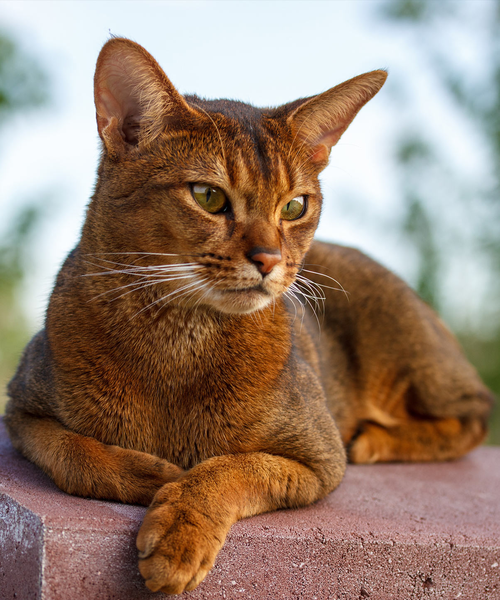

# **_Abyssinian_**

## History ##

(**_Zulu, the first Abyssinian cat_**)

The Abyssinian is a breed of cat with a distinctive "ticked" tabby coat, in which individual hairs are banded with different colours. They are also known simply as Abys. 

The first members of the breed to be exhibited in England were brought there from Abyssinia (now known as Ethiopia), hence the name. Genetic studies place the breed's origins in Southeast Asia and the coasts of the Indian Ocean, however. It is possible that the breed was introduced to Abyssinia by travelers who had stopped in Calcutta.

Once a comparatively obscure breed, the Abyssinian had become one of the top five most popular cat breeds by 2016.

## Appearance ##

The Abyssinian is a lithe, fine-boned, muscular, medium to large sized cat. The average weight is 10 lb (4.5 kg) ranging between 8–12 lb (3.6–5.4 kg) with height ranging between 8–10 in (20–25 cm). The head is moderately wedge-shaped, with a slight break at the muzzle, and nose and chin ideally forming a straight vertical line when viewed in profile. They have alert, relatively large pointed ears. The eyes are almond-shaped and are gold, green, hazel or copper depending on coat colour. The legs tend to be long in proportion to a graceful body, with small oval paws; the tail is likewise long and tapering.